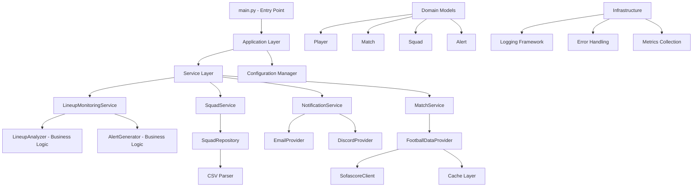

# LineupTracker Architecture Improvement Plan

**Generated:** 2024-12-20  
**Status:** Planning Phase  
**Priority:** Critical - Foundation for Production-Ready System  

---

## 🎯 Executive Summary

Your LineupTracker application shows **functional success** but has significant **architectural debt** that prevents it from meeting professional standards. The current codebase exhibits classic signs of rapid prototyping without proper design patterns.

### Critical Assessment
- **Current State:** Functional prototype with architectural debt
- **Target State:** Production-ready, maintainable, testable system
- **Effort Required:** 4-6 week structured refactoring
- **Business Impact:** Transform maintenance nightmare into scalable solution

---

## 🔍 Current Architecture Analysis

### Core Issues Identified

#### 1. VIOLATION OF SOLID PRINCIPLES
- **Single Responsibility**: `LineupMonitor` class (330 lines) handles CSV parsing, API calls, business logic, notifications, and logging
- **Open/Closed**: Hard to extend without modifying existing code
- **Dependency Inversion**: Direct instantiation of dependencies everywhere

#### 2. POOR SEPARATION OF CONCERNS
```python
# lineup_monitor.py lines 12-135
# CSV parsing mixed with business logic in one massive method
def load_squad(self):
    # 80+ lines doing parsing, validation, logging, and data transformation
```

#### 3. ASYNC/SYNC MIXING ANTI-PATTERN
```python
# sofascore_client.py lines 37-50
# Hacky workaround for async in sync context
def _run_async(self, coro):
    loop = self._get_loop()
    try:
        if loop.is_running():
            logger.warning("Event loop is already running, skipping async operation")
            return []
```

#### 4. CONFIGURATION MANAGEMENT ISSUES
- Environment variables scattered throughout code
- No centralized configuration
- Hard-coded values mixed with dynamic config

#### 5. ERROR HANDLING INCONSISTENCIES
- Mix of try/catch, silent failures, and different logging patterns
- No structured error types
- Inconsistent recovery strategies

### Code Quality Issues
1. **No Type Hints** - Makes maintenance difficult
2. **Magic Numbers/Strings** - Hard-coded timeouts, status codes
3. **Long Methods** - CSV parser method is 95 lines
4. **No Data Validation** - Raw CSV data used directly
5. **Mixed Abstraction Levels** - Low-level parsing mixed with high-level business logic

### Testing & Reliability Issues
1. **No Unit Tests** - Only integration tests exist
2. **No Mocking** - Can't test components in isolation  
3. **No Dependency Injection** - Impossible to test with fake dependencies
4. **Silent Failures** - Errors logged but not properly handled

### Scalability & Maintainability Issues
1. **Tight Coupling** - Classes directly instantiate dependencies
2. **No Interfaces** - Can't swap implementations
3. **No Data Models** - Dictionaries used for complex data
4. **Inconsistent Patterns** - Different error handling across modules

---

## 📋 Comprehensive Improvement Plan

### PHASE 1: CORE ARCHITECTURAL PATTERNS ⭐ CRITICAL
**Priority: HIGHEST - Foundation for everything else**
**Timeline: Week 1-2**

#### 1.1 Data Models & Type Safety
```python
# Create: src/lineup_tracker/domain/models.py
from dataclasses import dataclass
from datetime import datetime
from enum import Enum
from typing import Optional, List

class Position(Enum):
    GOALKEEPER = "Goalkeeper"
    DEFENDER = "Defender"
    MIDFIELDER = "Midfielder"
    FORWARD = "Forward"

class PlayerStatus(Enum):
    ACTIVE = "Act"
    RESERVE = "Res"

class MatchStatus(Enum):
    NOT_STARTED = "NS"
    LIVE = "LIVE"
    FINISHED = "FT"
    POSTPONED = "PST"
    CANCELLED = "CANC"

@dataclass
class Team:
    name: str
    abbreviation: str

@dataclass
class Player:
    id: str
    name: str
    team: Team
    position: Position
    status: PlayerStatus
    fantasy_points: float
    average_points: float
    age: Optional[int] = None
    opponent: Optional[str] = None
    games_played: Optional[int] = None

@dataclass
class Match:
    id: str
    home_team: Team
    away_team: Team
    kickoff: datetime
    status: MatchStatus
    elapsed_time: Optional[int] = None

@dataclass
class Squad:
    players: List[Player]
    
    @property
    def active_players(self) -> List[Player]:
        return [p for p in self.players if p.status == PlayerStatus.ACTIVE]
    
    @property
    def reserve_players(self) -> List[Player]:
        return [p for p in self.players if p.status == PlayerStatus.RESERVE]

@dataclass
class Lineup:
    team: Team
    starting_eleven: List[str]  # Player names
    substitutes: List[str]

@dataclass
class Alert:
    player: Player
    match: Match
    alert_type: str
    message: str
    urgency: str
    timestamp: datetime
```

#### 1.2 Interfaces & Protocols
```python
# Create: src/lineup_tracker/domain/interfaces.py
from typing import Protocol, List, Optional
from datetime import datetime
from .models import Match, Lineup, Squad, Alert

class FootballDataProvider(Protocol):
    async def get_fixtures(self, date: Optional[datetime] = None) -> List[Match]:
        """Get fixtures for a specific date"""
        ...
    
    async def get_lineup(self, match_id: str) -> Optional[Lineup]:
        """Get lineup for a specific match"""
        ...
    
    async def test_connection(self) -> bool:
        """Test API connection"""
        ...

class NotificationProvider(Protocol):
    async def send_alert(self, alert: Alert) -> bool:
        """Send an alert notification"""
        ...
    
    async def send_info(self, message: str) -> bool:
        """Send informational message"""
        ...

class SquadRepository(Protocol):
    def load_squad(self, file_path: str) -> Squad:
        """Load squad from data source"""
        ...
    
    def save_squad(self, squad: Squad, file_path: str) -> bool:
        """Save squad to data source"""
        ...
```

#### 1.3 Dependency Injection Container
```python
# Create: src/lineup_tracker/container.py
from dataclasses import dataclass
from typing import Dict, Any
from .providers.sofascore_client import SofascoreClient
from .providers.email_provider import EmailProvider
from .providers.discord_provider import DiscordProvider
from .services.notification_service import NotificationService
from .repositories.squad_repository import CSVSquadRepository
from .config.app_config import AppConfig

@dataclass
class Container:
    """Dependency injection container"""
    config: AppConfig
    
    def __post_init__(self):
        self._instances: Dict[str, Any] = {}
    
    @property
    def football_api(self) -> FootballDataProvider:
        if 'football_api' not in self._instances:
            self._instances['football_api'] = SofascoreClient(self.config.api_settings)
        return self._instances['football_api']
    
    @property
    def notification_service(self) -> NotificationService:
        if 'notification_service' not in self._instances:
            providers = []
            if self.config.notification_settings.email_enabled:
                providers.append(EmailProvider(self.config.notification_settings.email))
            if self.config.notification_settings.discord_enabled:
                providers.append(DiscordProvider(self.config.notification_settings.discord))
            
            self._instances['notification_service'] = NotificationService(providers)
        return self._instances['notification_service']
    
    @property
    def squad_repository(self) -> SquadRepository:
        if 'squad_repository' not in self._instances:
            self._instances['squad_repository'] = CSVSquadRepository()
        return self._instances['squad_repository']
```

### PHASE 2: SEPARATION OF CONCERNS ⭐ HIGH
**Timeline: Week 2-3**

#### 2.1 Service Layer Architecture
```python
# Create: src/lineup_tracker/services/lineup_monitoring_service.py
from typing import List
from ..domain.interfaces import FootballDataProvider, NotificationProvider, SquadRepository
from ..domain.models import Match, Squad, Alert
from ..business.lineup_analyzer import LineupAnalyzer
from ..business.alert_generator import AlertGenerator

class LineupMonitoringService:
    def __init__(
        self, 
        football_api: FootballDataProvider,
        notification_service: NotificationProvider,
        squad_repo: SquadRepository,
        analyzer: LineupAnalyzer,
        alert_generator: AlertGenerator
    ):
        self.football_api = football_api
        self.notification_service = notification_service
        self.squad_repo = squad_repo
        self.analyzer = analyzer
        self.alert_generator = alert_generator
    
    async def run_monitoring_cycle(self) -> None:
        """Execute one complete monitoring cycle"""
        try:
            # Load current squad
            squad = self.squad_repo.load_squad("my_roster.csv")
            
            # Get relevant matches
            matches = await self._get_relevant_matches(squad)
            
            # Check each match
            for match in matches:
                await self._check_match_lineup(match, squad)
                
        except Exception as e:
            await self._handle_monitoring_error(e)
    
    async def _get_relevant_matches(self, squad: Squad) -> List[Match]:
        """Get matches involving squad players"""
        all_fixtures = await self.football_api.get_fixtures()
        squad_teams = {player.team.name for player in squad.players}
        
        return [
            match for match in all_fixtures
            if match.home_team.name in squad_teams or match.away_team.name in squad_teams
        ]
    
    async def _check_match_lineup(self, match: Match, squad: Squad) -> None:
        """Check lineup for a specific match"""
        lineup = await self.football_api.get_lineup(match.id)
        if not lineup:
            return
        
        # Analyze lineup discrepancies
        discrepancies = self.analyzer.analyze_discrepancies(match, lineup, squad)
        
        # Generate and send alerts
        for discrepancy in discrepancies:
            alert = self.alert_generator.create_alert(discrepancy, match)
            await self.notification_service.send_alert(alert)
```

#### 2.2 Repository Pattern
```python
# Create: src/lineup_tracker/repositories/squad_repository.py
import csv
import logging
from typing import List
from ..domain.models import Squad, Player, Team, Position, PlayerStatus
from ..utils.team_mappings import get_full_team_name

logger = logging.getLogger(__name__)

class CSVSquadRepository:
    """Repository for loading squad data from CSV files"""
    
    def load_squad(self, file_path: str) -> Squad:
        """Load squad from Fantrax CSV export"""
        try:
            players = self._parse_csv_file(file_path)
            return Squad(players=players)
        except FileNotFoundError:
            logger.error(f"Squad file not found: {file_path}")
            raise SquadLoadError(f"Squad file not found: {file_path}")
        except Exception as e:
            logger.error(f"Failed to load squad: {e}")
            raise SquadLoadError(f"Failed to load squad: {e}")
    
    def _parse_csv_file(self, file_path: str) -> List[Player]:
        """Parse Fantrax CSV format with mixed sections"""
        players = []
        current_section = None
        current_headers = None
        
        with open(file_path, 'r', encoding='utf-8') as file:
            lines = file.readlines()
        
        for line_num, line in enumerate(lines, 1):
            line = line.strip()
            if not line:
                continue
            
            try:
                row_data = next(csv.reader([line]))
            except:
                logger.warning(f"Could not parse line {line_num}: {line}")
                continue
            
            # Handle section headers
            if len(row_data) >= 2 and row_data[1] in ['Goalkeeper', 'Outfielder']:
                current_section = row_data[1]
                continue
            
            # Handle column headers
            if len(row_data) > 0 and row_data[0] == 'ID':
                current_headers = row_data
                continue
            
            # Handle player data
            if len(row_data) > 0 and row_data[0].startswith('*') and current_headers:
                player = self._create_player_from_row(row_data, current_headers, current_section)
                if player:
                    players.append(player)
        
        return players
    
    def _create_player_from_row(self, row_data: List[str], headers: List[str], section: str) -> Optional[Player]:
        """Create Player object from CSV row data"""
        try:
            player_data = {
                headers[i]: row_data[i] if i < len(row_data) else ''
                for i in range(len(headers))
            }
            
            team = Team(
                name=get_full_team_name(player_data.get('Team', '')),
                abbreviation=player_data.get('Team', '')
            )
            
            return Player(
                id=player_data.get('ID', ''),
                name=player_data.get('Player', ''),
                team=team,
                position=self._map_position(player_data.get('Pos', '')),
                status=PlayerStatus.ACTIVE if player_data.get('Status', '').upper() == 'ACT' else PlayerStatus.RESERVE,
                fantasy_points=float(player_data.get('Fantasy Points', 0) or 0),
                average_points=float(player_data.get('Average Fantasy Points per Game', 0) or 0),
                age=int(player_data.get('Age', 0)) if player_data.get('Age', '').isdigit() else None,
                opponent=player_data.get('Opponent', ''),
                games_played=int(player_data.get('GP', 0)) if player_data.get('GP', '').isdigit() else None
            )
        except Exception as e:
            logger.warning(f"Error creating player from row: {e}")
            return None
    
    def _map_position(self, fantrax_position: str) -> Position:
        """Map Fantrax position codes to Position enum"""
        position_map = {
            'G': Position.GOALKEEPER,
            'D': Position.DEFENDER,
            'M': Position.MIDFIELDER,
            'F': Position.FORWARD
        }
        return position_map.get(fantrax_position, Position.MIDFIELDER)
```

#### 2.3 Business Logic Extraction
```python
# Create: src/lineup_tracker/business/lineup_analyzer.py
from typing import List, NamedTuple
from ..domain.models import Match, Lineup, Squad, Player

class LineupDiscrepancy(NamedTuple):
    player: Player
    expected_starting: bool
    actually_starting: bool
    discrepancy_type: str

class LineupAnalyzer:
    """Business logic for analyzing lineup discrepancies"""
    
    def analyze_discrepancies(self, match: Match, lineup: Lineup, squad: Squad) -> List[LineupDiscrepancy]:
        """Analyze lineup against squad expectations"""
        discrepancies = []
        
        # Get players from teams playing in this match
        relevant_players = self._get_relevant_players(match, squad)
        
        for player in relevant_players:
            expected_starting = player.status == PlayerStatus.ACTIVE
            actually_starting = player.name in lineup.starting_eleven
            
            if expected_starting != actually_starting:
                discrepancy_type = self._determine_discrepancy_type(expected_starting, actually_starting)
                discrepancies.append(LineupDiscrepancy(
                    player=player,
                    expected_starting=expected_starting,
                    actually_starting=actually_starting,
                    discrepancy_type=discrepancy_type
                ))
        
        return discrepancies
    
    def _get_relevant_players(self, match: Match, squad: Squad) -> List[Player]:
        """Get squad players from teams in this match"""
        team_names = {match.home_team.name, match.away_team.name}
        return [
            player for player in squad.players
            if player.team.name in team_names
        ]
    
    def _determine_discrepancy_type(self, expected: bool, actual: bool) -> str:
        """Determine the type of discrepancy"""
        if expected and not actual:
            return "unexpected_benching"
        elif not expected and actual:
            return "unexpected_starting"
        else:
            return "as_expected"
```

### PHASE 3: RELIABILITY & TESTING ⭐ HIGH
**Timeline: Week 3-4**

#### 3.1 Comprehensive Testing Strategy
```python
# Create: tests/unit/test_lineup_analyzer.py
import pytest
from datetime import datetime
from src.lineup_tracker.domain.models import *
from src.lineup_tracker.business.lineup_analyzer import LineupAnalyzer, LineupDiscrepancy

class TestLineupAnalyzer:
    def setup_method(self):
        self.analyzer = LineupAnalyzer()
        
        # Create test data
        self.team = Team(name="Liverpool", abbreviation="LIV")
        self.player_active = Player(
            id="1", name="Mohamed Salah", team=self.team,
            position=Position.FORWARD, status=PlayerStatus.ACTIVE,
            fantasy_points=100.0, average_points=10.0
        )
        self.player_reserve = Player(
            id="2", name="Backup Player", team=self.team,
            position=Position.FORWARD, status=PlayerStatus.RESERVE,
            fantasy_points=50.0, average_points=5.0
        )
        
        self.match = Match(
            id="match1", home_team=self.team, away_team=Team("Arsenal", "ARS"),
            kickoff=datetime.now(), status=MatchStatus.NOT_STARTED
        )
        
        self.squad = Squad(players=[self.player_active, self.player_reserve])
    
    def test_detects_benched_player(self):
        """Test detection of expected starter being benched"""
        lineup = Lineup(team=self.team, starting_eleven=[], substitutes=[])
        
        discrepancies = self.analyzer.analyze_discrepancies(self.match, lineup, self.squad)
        
        assert len(discrepancies) == 1
        assert discrepancies[0].player == self.player_active
        assert discrepancies[0].discrepancy_type == "unexpected_benching"
    
    def test_detects_unexpected_starter(self):
        """Test detection of reserve player starting"""
        lineup = Lineup(
            team=self.team, 
            starting_eleven=["Backup Player"], 
            substitutes=[]
        )
        
        discrepancies = self.analyzer.analyze_discrepancies(self.match, lineup, self.squad)
        
        assert len(discrepancies) == 2  # Active benched + Reserve starting
        unexpected_starter = next(d for d in discrepancies if d.discrepancy_type == "unexpected_starting")
        assert unexpected_starter.player == self.player_reserve
    
    def test_no_discrepancies_when_as_expected(self):
        """Test no discrepancies when lineup matches expectations"""
        lineup = Lineup(
            team=self.team,
            starting_eleven=["Mohamed Salah"],
            substitutes=["Backup Player"]
        )
        
        discrepancies = self.analyzer.analyze_discrepancies(self.match, lineup, self.squad)
        
        assert all(d.discrepancy_type == "as_expected" for d in discrepancies)

# Create: tests/integration/test_lineup_monitoring_service.py
import pytest
from unittest.mock import AsyncMock, Mock
from src.lineup_tracker.services.lineup_monitoring_service import LineupMonitoringService
from src.lineup_tracker.domain.models import *

class TestLineupMonitoringService:
    def setup_method(self):
        self.mock_api = AsyncMock()
        self.mock_notifier = AsyncMock()
        self.mock_repo = Mock()
        self.mock_analyzer = Mock()
        self.mock_alert_gen = Mock()
        
        self.service = LineupMonitoringService(
            self.mock_api, self.mock_notifier, self.mock_repo,
            self.mock_analyzer, self.mock_alert_gen
        )
    
    @pytest.mark.asyncio
    async def test_monitoring_cycle_with_mock_api(self):
        """Test full monitoring cycle with mocked dependencies"""
        # Setup mocks
        squad = Squad(players=[])
        matches = []
        
        self.mock_repo.load_squad.return_value = squad
        self.mock_api.get_fixtures.return_value = matches
        
        # Execute
        await self.service.run_monitoring_cycle()
        
        # Verify
        self.mock_repo.load_squad.assert_called_once()
        self.mock_api.get_fixtures.assert_called_once()
```

#### 3.2 Error Handling Framework
```python
# Create: src/lineup_tracker/domain/exceptions.py
class LineupMonitorError(Exception):
    """Base exception for lineup monitoring system"""
    pass

class APIConnectionError(LineupMonitorError):
    """Raised when API connection fails"""
    pass

class SquadLoadError(LineupMonitorError):
    """Raised when squad loading fails"""
    pass

class NotificationError(LineupMonitorError):
    """Raised when notification sending fails"""
    pass

class ConfigurationError(LineupMonitorError):
    """Raised when configuration is invalid"""
    pass

# Create: src/lineup_tracker/utils/retry.py
import asyncio
import logging
from functools import wraps
from typing import Callable, Type, Tuple

logger = logging.getLogger(__name__)

def retry(
    max_attempts: int = 3,
    backoff_factor: float = 1.0,
    exceptions: Tuple[Type[Exception], ...] = (Exception,)
):
    """Retry decorator with exponential backoff"""
    def decorator(func: Callable):
        @wraps(func)
        async def async_wrapper(*args, **kwargs):
            for attempt in range(max_attempts):
                try:
                    return await func(*args, **kwargs)
                except exceptions as e:
                    if attempt == max_attempts - 1:
                        logger.error(f"Function {func.__name__} failed after {max_attempts} attempts: {e}")
                        raise
                    
                    delay = backoff_factor * (2 ** attempt)
                    logger.warning(f"Attempt {attempt + 1} failed, retrying in {delay}s: {e}")
                    await asyncio.sleep(delay)
        
        @wraps(func)
        def sync_wrapper(*args, **kwargs):
            for attempt in range(max_attempts):
                try:
                    return func(*args, **kwargs)
                except exceptions as e:
                    if attempt == max_attempts - 1:
                        logger.error(f"Function {func.__name__} failed after {max_attempts} attempts: {e}")
                        raise
                    
                    delay = backoff_factor * (2 ** attempt)
                    logger.warning(f"Attempt {attempt + 1} failed, retrying in {delay}s: {e}")
                    import time
                    time.sleep(delay)
        
        return async_wrapper if asyncio.iscoroutinefunction(func) else sync_wrapper
    return decorator
```

#### 3.3 Structured Logging
```python
# Create: src/lineup_tracker/utils/logging.py
import logging
import json
from datetime import datetime
from typing import Any, Dict

class StructuredFormatter(logging.Formatter):
    """JSON structured logging formatter"""
    
    def format(self, record: logging.LogRecord) -> str:
        log_entry = {
            'timestamp': datetime.utcnow().isoformat(),
            'level': record.levelname,
            'logger': record.name,
            'message': record.getMessage(),
            'module': record.module,
            'function': record.funcName,
            'line': record.lineno
        }
        
        # Add any extra fields
        if hasattr(record, 'extra_fields'):
            log_entry.update(record.extra_fields)
        
        return json.dumps(log_entry)

def get_logger(name: str) -> logging.Logger:
    """Get logger with structured formatting"""
    logger = logging.getLogger(name)
    
    if not logger.handlers:
        handler = logging.StreamHandler()
        handler.setFormatter(StructuredFormatter())
        logger.addHandler(handler)
        logger.setLevel(logging.INFO)
    
    return logger

def log_with_context(logger: logging.Logger, level: str, message: str, **context):
    """Log with additional context fields"""
    record = logger.makeRecord(
        logger.name, getattr(logging, level.upper()), 
        '', 0, message, (), None
    )
    record.extra_fields = context
    logger.handle(record)

# Usage example:
# logger = get_logger(__name__)
# log_with_context(logger, 'info', 'Lineup check started', 
#                  match_id=match.id, home_team=match.home_team.name)
```

### PHASE 4: CONFIGURATION MANAGEMENT ⭐ MEDIUM
**Timeline: Week 4**

#### 4.1 Centralized Configuration
```python
# Create: src/lineup_tracker/config/app_config.py
from dataclasses import dataclass, field
from typing import Optional
import os
from dotenv import load_dotenv

@dataclass
class APIConfig:
    """API configuration settings"""
    base_url: str = "https://api.sofascore.com"
    timeout: int = 30
    max_retries: int = 3
    rate_limit_per_minute: int = 60
    
    def __post_init__(self):
        if self.timeout <= 0:
            raise ValueError("API timeout must be positive")
        if self.max_retries < 0:
            raise ValueError("Max retries cannot be negative")

@dataclass
class EmailConfig:
    """Email notification configuration"""
    smtp_server: str
    smtp_port: int
    username: str
    password: str
    recipient: str
    
    def __post_init__(self):
        if not all([self.smtp_server, self.username, self.password, self.recipient]):
            raise ValueError("All email fields must be provided")

@dataclass
class DiscordConfig:
    """Discord notification configuration"""
    webhook_url: str
    
    def __post_init__(self):
        if not self.webhook_url or not self.webhook_url.startswith('https://'):
            raise ValueError("Valid Discord webhook URL required")

@dataclass
class NotificationConfig:
    """Notification system configuration"""
    email_enabled: bool = False
    discord_enabled: bool = False
    email: Optional[EmailConfig] = None
    discord: Optional[DiscordConfig] = None
    
    def __post_init__(self):
        if self.email_enabled and not self.email:
            raise ValueError("Email config required when email notifications enabled")
        if self.discord_enabled and not self.discord:
            raise ValueError("Discord config required when Discord notifications enabled")

@dataclass
class MonitoringConfig:
    """Monitoring behavior configuration"""
    check_interval_minutes: int = 15
    pre_match_window_minutes: int = 60
    final_sprint_minutes: int = 5
    final_sprint_interval_minutes: int = 1
    squad_file_path: str = "my_roster.csv"
    
    def __post_init__(self):
        if self.check_interval_minutes <= 0:
            raise ValueError("Check interval must be positive")

@dataclass
class AppConfig:
    """Main application configuration"""
    api_settings: APIConfig
    notification_settings: NotificationConfig
    monitoring_settings: MonitoringConfig
    log_level: str = "INFO"
    user_timezone: str = "UTC"
    
    @classmethod
    def from_env(cls) -> 'AppConfig':
        """Create configuration from environment variables"""
        load_dotenv()
        
        # API settings
        api_settings = APIConfig()
        
        # Email settings
        email_config = None
        if all(os.getenv(key) for key in ['EMAIL_SMTP_SERVER', 'EMAIL_USERNAME', 'EMAIL_PASSWORD', 'EMAIL_RECIPIENT']):
            email_config = EmailConfig(
                smtp_server=os.getenv('EMAIL_SMTP_SERVER'),
                smtp_port=int(os.getenv('EMAIL_SMTP_PORT', '587')),
                username=os.getenv('EMAIL_USERNAME'),
                password=os.getenv('EMAIL_PASSWORD'),
                recipient=os.getenv('EMAIL_RECIPIENT')
            )
        
        # Discord settings
        discord_config = None
        if os.getenv('DISCORD_WEBHOOK_URL'):
            discord_config = DiscordConfig(
                webhook_url=os.getenv('DISCORD_WEBHOOK_URL')
            )
        
        # Notification settings
        notification_settings = NotificationConfig(
            email_enabled=email_config is not None,
            discord_enabled=discord_config is not None,
            email=email_config,
            discord=discord_config
        )
        
        # Monitoring settings
        monitoring_settings = MonitoringConfig()
        
        return cls(
            api_settings=api_settings,
            notification_settings=notification_settings,
            monitoring_settings=monitoring_settings,
            log_level=os.getenv('LOG_LEVEL', 'INFO'),
            user_timezone=os.getenv('USER_TIMEZONE', 'UTC')
        )
```

### PHASE 5: ASYNC/PERFORMANCE OPTIMIZATION ⭐ MEDIUM
**Timeline: Week 5**

#### 5.1 Proper Async Architecture
```python
# Create: src/lineup_tracker/providers/async_sofascore_client.py
import asyncio
import aiohttp
from typing import List, Optional
from ..domain.interfaces import FootballDataProvider
from ..domain.models import Match, Lineup, Team, MatchStatus
from ..config.app_config import APIConfig
from ..utils.retry import retry

class AsyncSofascoreClient(FootballDataProvider):
    """Proper async implementation of Sofascore client"""
    
    def __init__(self, config: APIConfig):
        self.config = config
        self._session: Optional[aiohttp.ClientSession] = None
        self._semaphore = asyncio.Semaphore(config.rate_limit_per_minute)
    
    async def __aenter__(self):
        await self._ensure_session()
        return self
    
    async def __aexit__(self, exc_type, exc_val, exc_tb):
        await self.close()
    
    async def _ensure_session(self):
        """Ensure aiohttp session is created"""
        if self._session is None or self._session.closed:
            timeout = aiohttp.ClientTimeout(total=self.config.timeout)
            self._session = aiohttp.ClientSession(timeout=timeout)
    
    @retry(max_attempts=3, exceptions=(aiohttp.ClientError, asyncio.TimeoutError))
    async def get_fixtures(self, date: Optional[datetime] = None) -> List[Match]:
        """Get Premier League fixtures with proper async implementation"""
        async with self._semaphore:  # Rate limiting
            await self._ensure_session()
            
            # Implementation using sofascore-wrapper async methods
            from sofascore_wrapper.api import SofascoreAPI
            from sofascore_wrapper.league import League
            
            api = SofascoreAPI()
            premier_league = League(api, league_id=17)
            
            fixtures = await premier_league.next_fixtures()
            return [self._convert_fixture(f) for f in fixtures]
    
    @retry(max_attempts=3, exceptions=(aiohttp.ClientError, asyncio.TimeoutError))
    async def get_lineup(self, match_id: str) -> Optional[Lineup]:
        """Get lineup with proper error handling"""
        async with self._semaphore:
            await self._ensure_session()
            
            try:
                from sofascore_wrapper.match import Match as SofaMatch
                from sofascore_wrapper.api import SofascoreAPI
                
                api = SofascoreAPI()
                match = SofaMatch(api, match_id=match_id)
                
                home_lineup = await match.lineups_home()
                away_lineup = await match.lineups_away()
                
                if not home_lineup or not away_lineup:
                    return None
                
                return self._convert_lineup(home_lineup, away_lineup, match)
                
            except Exception as e:
                if "404" in str(e):
                    return None  # Lineup not available yet
                raise
    
    async def get_multiple_lineups(self, match_ids: List[str]) -> List[Optional[Lineup]]:
        """Get multiple lineups concurrently"""
        tasks = [self.get_lineup(match_id) for match_id in match_ids]
        return await asyncio.gather(*tasks, return_exceptions=False)
    
    async def test_connection(self) -> bool:
        """Test API connection"""
        try:
            fixtures = await self.get_fixtures()
            return fixtures is not None
        except Exception:
            return False
    
    async def close(self):
        """Clean up resources"""
        if self._session and not self._session.closed:
            await self._session.close()
```

#### 5.2 Caching Strategy
```python
# Create: src/lineup_tracker/utils/cache.py
import asyncio
import time
from typing import Any, Optional, Dict, Callable
from functools import wraps

class TTLCache:
    """Simple TTL (Time To Live) cache implementation"""
    
    def __init__(self):
        self._cache: Dict[str, Dict[str, Any]] = {}
        self._lock = asyncio.Lock()
    
    async def get(self, key: str) -> Optional[Any]:
        """Get value from cache if not expired"""
        async with self._lock:
            if key in self._cache:
                entry = self._cache[key]
                if time.time() < entry['expires_at']:
                    return entry['value']
                else:
                    del self._cache[key]
            return None
    
    async def set(self, key: str, value: Any, ttl: int):
        """Set value in cache with TTL in seconds"""
        async with self._lock:
            self._cache[key] = {
                'value': value,
                'expires_at': time.time() + ttl
            }
    
    async def clear(self):
        """Clear all cache entries"""
        async with self._lock:
            self._cache.clear()

# Global cache instance
_cache = TTLCache()

def cached(ttl: int):
    """Decorator to cache function results"""
    def decorator(func: Callable):
        @wraps(func)
        async def wrapper(*args, **kwargs):
            # Create cache key from function name and arguments
            cache_key = f"{func.__name__}:{hash(str(args) + str(sorted(kwargs.items())))}"
            
            # Try to get from cache
            result = await _cache.get(cache_key)
            if result is not None:
                return result
            
            # Execute function and cache result
            result = await func(*args, **kwargs)
            await _cache.set(cache_key, result, ttl)
            return result
        
        return wrapper
    return decorator

# Usage example:
# @cached(ttl=300)  # Cache for 5 minutes
# async def get_fixtures(self):
#     # Expensive API call
#     pass
```

### PHASE 6: OBSERVABILITY & MONITORING ⭐ LOW
**Timeline: Week 6**

#### 6.1 Health Checks & Metrics
```python
# Create: src/lineup_tracker/monitoring/health_checker.py
from dataclasses import dataclass
from typing import Dict, List
from enum import Enum
import asyncio
import time

class HealthStatus(Enum):
    HEALTHY = "healthy"
    DEGRADED = "degraded"
    UNHEALTHY = "unhealthy"

@dataclass
class HealthCheck:
    name: str
    status: HealthStatus
    message: str
    response_time_ms: float
    timestamp: float

class HealthChecker:
    """System health monitoring"""
    
    def __init__(self, container):
        self.container = container
    
    async def check_all(self) -> Dict[str, HealthCheck]:
        """Run all health checks"""
        checks = await asyncio.gather(
            self.check_api_health(),
            self.check_notification_health(),
            self.check_squad_repository_health(),
            return_exceptions=True
        )
        
        return {
            'api': checks[0],
            'notifications': checks[1],
            'squad_repository': checks[2]
        }
    
    async def check_api_health(self) -> HealthCheck:
        """Check API connection health"""
        start_time = time.time()
        try:
            api = self.container.football_api
            result = await api.test_connection()
            response_time = (time.time() - start_time) * 1000
            
            if result:
                return HealthCheck(
                    name="football_api",
                    status=HealthStatus.HEALTHY,
                    message="API connection successful",
                    response_time_ms=response_time,
                    timestamp=time.time()
                )
            else:
                return HealthCheck(
                    name="football_api",
                    status=HealthStatus.UNHEALTHY,
                    message="API connection failed",
                    response_time_ms=response_time,
                    timestamp=time.time()
                )
        except Exception as e:
            return HealthCheck(
                name="football_api",
                status=HealthStatus.UNHEALTHY,
                message=f"API health check error: {str(e)}",
                response_time_ms=(time.time() - start_time) * 1000,
                timestamp=time.time()
            )
    
    async def check_notification_health(self) -> HealthCheck:
        """Check notification system health"""
        start_time = time.time()
        try:
            # Test notification without actually sending
            notifier = self.container.notification_service
            # Implement test method that doesn't send actual notifications
            result = await notifier.test_configuration()
            
            response_time = (time.time() - start_time) * 1000
            
            return HealthCheck(
                name="notifications",
                status=HealthStatus.HEALTHY if result else HealthStatus.DEGRADED,
                message="Notification system ready" if result else "Some notification methods unavailable",
                response_time_ms=response_time,
                timestamp=time.time()
            )
        except Exception as e:
            return HealthCheck(
                name="notifications",
                status=HealthStatus.UNHEALTHY,
                message=f"Notification health check error: {str(e)}",
                response_time_ms=(time.time() - start_time) * 1000,
                timestamp=time.time()
            )
```

#### 6.2 Metrics Collection
```python
# Create: src/lineup_tracker/monitoring/metrics.py
from dataclasses import dataclass, field
from typing import Dict, List
import time
from collections import defaultdict, deque

@dataclass
class Metric:
    name: str
    value: float
    timestamp: float
    tags: Dict[str, str] = field(default_factory=dict)

class MetricsCollector:
    """Simple metrics collection system"""
    
    def __init__(self, max_history: int = 1000):
        self.metrics: Dict[str, deque] = defaultdict(lambda: deque(maxlen=max_history))
        self.counters: Dict[str, int] = defaultdict(int)
    
    def record_duration(self, name: str, duration: float, **tags):
        """Record a duration metric"""
        metric = Metric(
            name=name,
            value=duration,
            timestamp=time.time(),
            tags=tags
        )
        self.metrics[name].append(metric)
    
    def increment_counter(self, name: str, value: int = 1, **tags):
        """Increment a counter metric"""
        self.counters[name] += value
        metric = Metric(
            name=name,
            value=self.counters[name],
            timestamp=time.time(),
            tags=tags
        )
        self.metrics[name].append(metric)
    
    def get_average(self, name: str, window_seconds: int = 300) -> float:
        """Get average value for a metric in time window"""
        cutoff = time.time() - window_seconds
        values = [
            m.value for m in self.metrics[name]
            if m.timestamp > cutoff
        ]
        return sum(values) / len(values) if values else 0.0
    
    def get_counter_value(self, name: str) -> int:
        """Get current counter value"""
        return self.counters[name]

# Global metrics instance
metrics = MetricsCollector()

# Usage examples:
# metrics.record_duration("api_call_duration", 0.5, endpoint="fixtures")
# metrics.increment_counter("notifications_sent", provider="discord")
```

---

## 🏗️ Target Architecture Diagram



---

## 📁 Recommended Project Structure

```
lineup_tracker/
├── src/
│   ├── lineup_tracker/
│   │   ├── __init__.py
│   │   ├── main.py                 # Application entry point
│   │   ├── container.py            # Dependency injection container
│   │   ├── config/
│   │   │   ├── __init__.py
│   │   │   ├── app_config.py       # Configuration models
│   │   │   └── settings.py         # Environment loading
│   │   ├── domain/
│   │   │   ├── __init__.py
│   │   │   ├── models.py           # Data models (Player, Match, etc.)
│   │   │   ├── interfaces.py       # Protocols and interfaces
│   │   │   ├── enums.py            # Status enums, positions
│   │   │   └── exceptions.py       # Domain-specific exceptions
│   │   ├── services/
│   │   │   ├── __init__.py
│   │   │   ├── lineup_monitoring_service.py   # Core business logic
│   │   │   ├── squad_service.py    # Squad management
│   │   │   ├── match_service.py    # Match operations
│   │   │   └── notification_service.py
│   │   ├── repositories/
│   │   │   ├── __init__.py
│   │   │   ├── squad_repository.py # Data access layer
│   │   │   └── cache_repository.py
│   │   ├── providers/
│   │   │   ├── __init__.py
│   │   │   ├── football_api.py     # API client interfaces
│   │   │   ├── sofascore_client.py # Implementation
│   │   │   ├── email_provider.py   # Notification providers
│   │   │   └── discord_provider.py
│   │   ├── business/
│   │   │   ├── __init__.py
│   │   │   ├── lineup_analyzer.py  # Business rules
│   │   │   └── alert_generator.py
│   │   ├── monitoring/
│   │   │   ├── __init__.py
│   │   │   ├── health_checker.py   # Health monitoring
│   │   │   └── metrics.py          # Metrics collection
│   │   └── utils/
│   │       ├── __init__.py
│   │       ├── logging.py          # Structured logging
│   │       ├── retry.py            # Retry decorators
│   │       ├── cache.py            # Caching utilities
│   │       ├── validation.py       # Data validation
│   │       └── team_mappings.py    # Team name mappings
├── tests/
│   ├── __init__.py
│   ├── unit/
│   │   ├── test_lineup_analyzer.py
│   │   ├── test_squad_repository.py
│   │   └── test_notification_service.py
│   ├── integration/
│   │   ├── test_lineup_monitoring_service.py
│   │   └── test_api_clients.py
│   ├── fixtures/
│   │   ├── sample_squad.csv
│   │   └── mock_api_responses.json
│   └── conftest.py                # Test configuration
├── docs/
│   ├── api.md
│   ├── configuration.md
│   └── deployment.md
├── scripts/
│   ├── setup.py
│   └── migrate_data.py
├── requirements/
│   ├── base.txt
│   ├── dev.txt
│   └── prod.txt
├── pyproject.toml
├── Dockerfile
├── docker-compose.yml
├── .gitignore
├── .env.example
└── README.md
```

---

## ⚡ Implementation Timeline

### Week 1-2: Foundation (PHASE 1)
- [ ] Create domain models with type hints
- [ ] Implement basic dependency injection
- [ ] Extract core interfaces and protocols
- [ ] Set up project structure

### Week 2-3: Service Layer (PHASE 2)  
- [ ] Split LineupMonitor into focused services
- [ ] Implement repository pattern
- [ ] Extract business logic into analyzers
- [ ] Create proper data access layer

### Week 3-4: Reliability (PHASE 3)
- [ ] Add comprehensive unit tests
- [ ] Implement error handling framework
- [ ] Add structured logging
- [ ] Create integration tests with mocks

### Week 4: Configuration (PHASE 4)
- [ ] Centralize configuration management
- [ ] Add validation and defaults
- [ ] Environment-based configuration
- [ ] Configuration testing

### Week 5: Performance (PHASE 5)
- [ ] Fix async/sync architecture
- [ ] Implement proper async patterns
- [ ] Add caching strategy
- [ ] Performance optimization

### Week 6: Observability (PHASE 6)
- [ ] Add health checks
- [ ] Implement metrics collection
- [ ] Create monitoring dashboard
- [ ] Add alerting for system issues

---

## 🎯 Success Metrics

### Code Quality
- [ ] 100% type hint coverage
- [ ] 90%+ test coverage  
- [ ] No methods > 20 lines
- [ ] No classes > 200 lines
- [ ] Cyclomatic complexity < 10
- [ ] Zero pylint/mypy errors

### Architecture
- [ ] Clear separation of concerns
- [ ] Dependency injection throughout
- [ ] Proper error handling patterns
- [ ] Consistent async/await usage
- [ ] No circular dependencies

### Reliability
- [ ] Comprehensive test suite
- [ ] Graceful failure handling
- [ ] Monitoring and alerting
- [ ] Zero silent failures
- [ ] Automatic recovery mechanisms

### Performance
- [ ] Response times < 500ms
- [ ] Memory usage < 100MB
- [ ] Efficient API usage
- [ ] Proper caching strategy
- [ ] Concurrent processing

---

## 🚀 Getting Started

### Prerequisites
1. Review this plan thoroughly
2. Backup current working system
3. Create feature branch for refactoring
4. Set up development environment

### First Steps
1. **Start with Phase 1**: Create `src/lineup_tracker/domain/models.py`
2. **Set up tests**: Create basic test structure
3. **Incremental approach**: Keep current system working while refactoring
4. **Validate each phase**: Ensure tests pass before moving to next phase

### Command to Begin
```bash
# Create new branch for refactoring
git checkout -b feature/architecture-refactor

# Create new project structure
mkdir -p src/lineup_tracker/{domain,services,repositories,providers,business,monitoring,utils,config}
mkdir -p tests/{unit,integration,fixtures}

# Start with Phase 1: Domain models
touch src/lineup_tracker/domain/{__init__.py,models.py,interfaces.py,enums.py,exceptions.py}
```

---

## 📞 Support & Questions

This plan is comprehensive but can be adapted based on:
- Available development time
- Priority of specific features
- Business requirements
- Technical constraints

**Next Action**: Review this plan and confirm which phase to start with. Recommend beginning with **Phase 1** as it provides the foundation for all subsequent improvements.
